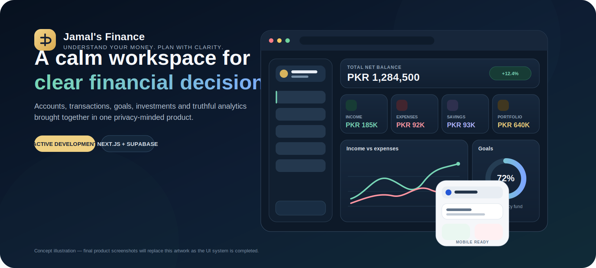
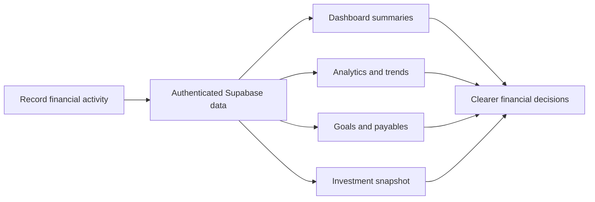
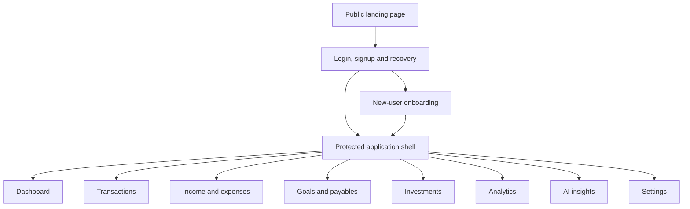
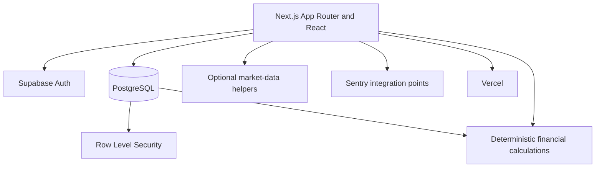

<div align="center">



<sub>Concept illustration. Financial values shown in the artwork are illustrative only.</sub>

# Jamal's Finance

### Understand your money. Plan with clarity.

A privacy-minded personal finance workspace for tracking income, expenses, accounts, goals, payables, investments, and truthful financial trends from one calm dashboard.

[](https://jamals-finance-sable.vercel.app)
[](https://nextjs.org/)
[](https://react.dev/)
[](https://www.typescriptlang.org/)
[](https://supabase.com/)
[](https://vercel.com/)

[Live app](https://jamals-finance-sable.vercel.app) | [Security](SECURITY.md) | [Contributing](CONTRIBUTING.md) | [Code of Conduct](CODE_OF_CONDUCT.md) | [Local setup](#local-development)

</div>

> [!IMPORTANT]
> **Project status: active development.** The product is usable today, while analytics, UI/UX consistency, accessibility, performance, globalisation, reporting, and cross-device polish continue to be hardened through small, auditable roadmap nodes.

## Why this project exists

Personal-finance software should make money clearer without pretending to know more than the data actually says. Jamal's Finance is being built around four product principles:

| Principle | What it means in practice |
| --- | --- |
| **Truthful financial data** | No fabricated balances, fake trends, fallback investments, or failed queries displayed as genuine zero values. |
| **Power without clutter** | Advanced capability stays discoverable while default screens remain calm and approachable. |
| **Privacy and ownership** | User-owned records remain behind authenticated access and owner-scoped database policies. |
| **Cross-device quality** | Forms, charts, dialogs, navigation, and states are designed for mobile, tablet, laptop, and desktop use. |

## Product at a glance

| Money tracking | Planning | Financial intelligence |
| --- | --- | --- |
| Accounts | Savings goals | Dashboard summaries |
| Income | Payables | Period-based analytics |
| Expenses | Investments | Spending breakdowns |
| Transactions | Category management | Reports and AI surfaces under hardening |

### Current capabilities

- Public landing experience with protected product routes
- Email/password authentication, email verification, password recovery, and optional Google OAuth configuration
- Account, income, expense, transaction, goal, investment, and payable tracking
- Parent/child category management
- Dashboard summaries and financial activity views
- Period-based income, expense, savings, spending, cash-flow, and investment analytics
- Semantic light, dark, and system themes with shared responsive finance forms
- Responsive desktop and mobile navigation
- Supabase-backed persistence with owner-scoped Row Level Security
- Sentry integration points for production monitoring
- Vercel production deployment

Some visible modules are still evolving. A control is not considered complete merely because it renders; it must also have truthful behavior, safe failure states, accessibility, responsive states, and production verification.

## How the product works



## Product experience map



## Development status

Development is intentionally split into focused nodes so that financial integrity, security, and UI changes can be audited independently.

| Area | Status |
| --- | --- |
| Analytics data integrity | Complete |
| Settings security integrity | Complete |
| Supabase session recovery | Complete |
| Authentication and onboarding | Complete |
| Global shell and navigation | Complete |
| Dashboard financial semantics | Complete |
| Semantic theme and responsive finance forms | Complete |
| Route loading and motion consistency | Active iteration |
| AI reliability, globalisation, PWA, and release hardening | Planned |

Active work remains isolated on scoped branches. Completed branches are integrated through reviewed pull requests so unfinished application changes do not leak into repository-maintenance work.

## Design and quality contract

The project is being held to a stricter standard than "the build passes." A page is complete only when all of the following are true:

```text
Functionality correct
+ financial calculations truthful
+ UI polished
+ UX clear
+ loading, empty, error, partial and offline states present
+ responsive across mobile, tablet and desktop
+ Light, Dark and System behavior correct
+ keyboard, touch and mouse usable
+ performance acceptable
+ no misleading financial visuals
+ no visual regression
+ production manually verified
```

Key interface rules:

- One shared design system for buttons, inputs, search, date pickers, dropdowns, cards, dialogs, charts, navigation, skeletons, and feedback states
- Lucide icons for interface actions; no emoji or mixed icon libraries
- Geist Sans for the product interface and tabular numbers for financial values
- Separate premium Light and Dark palettes rather than simple color inversion
- No browser-default visible controls where a branded accessible control is required
- No fake progress bars, live indicators, bank connections, or fabricated insights
- Skeletons should resemble the incoming content and adapt to the device layout
- Reduced-motion behavior must be respected

## Architecture



## Technology

| Area | Stack |
| --- | --- |
| Application | Next.js 16, React 19, TypeScript |
| Styling | Tailwind CSS 4, shared semantic design tokens |
| UI and motion | Base UI, Radix UI, Framer Motion, Lucide React |
| Charts | Recharts |
| Backend | Supabase, PostgreSQL, Supabase Auth |
| Security | Row Level Security, protected server/client data access |
| Monitoring | Sentry integration points |
| Testing and quality | Vitest, TypeScript, ESLint, production builds |
| Deployment | Vercel |

## Repository structure

```text
.github/                 CI, ownership, issue forms, and PR standards
app/
  api/                    Server route handlers
  auth/                   Authentication callback handling
  dashboard/              Protected product routes
  login/                  Login, signup and reset-request flow
  reset-password/         Password recovery completion
  layout.tsx              Root layout and application metadata
  page.tsx                Public landing page

components/
  analytics/              Analytics presentation
  currency/               Display-currency context
  dashboard/              Dashboard widgets
  layout/                 Desktop and mobile application shell
  settings/               Settings experience
  ui/                     Shared UI primitives
  ...                     Feature-specific components

lib/
  analytics/              Deterministic financial calculations and tests
  investments/            Investment aggregation and pricing helpers
  market/                 Market-data helpers
  settings/               Settings security helpers
  supabase/               Browser, server, and session helpers
  ...                     Shared application utilities

supabase/
  migrations/             Versioned database schema and security changes

public/                    Static public assets
proxy.ts                  Route and session boundary logic
```

## Local development

### Prerequisites

- Node.js 20 or newer
- npm
- A Supabase project for authenticated, persistent data

### 1. Clone the repository

```bash
git clone https://github.com/maijamalhoon/Jamals-finance.git
cd Jamals-finance
```

### 2. Install dependencies

```bash
npm install
```

### 3. Configure environment variables

Copy the committed template:

```bash
cp .env.example .env.local
```

On Windows Command Prompt:

```bat
copy .env.example .env.local
```

Core local authentication and data access require:

```env
NEXT_PUBLIC_SUPABASE_URL=
NEXT_PUBLIC_SUPABASE_ANON_KEY=
```

Optional integrations are configured only when the related feature is enabled:

```env
NEXT_PUBLIC_ENABLE_GOOGLE_AUTH=false

NEXT_PUBLIC_SENTRY_DSN=
SENTRY_AUTH_TOKEN=

GEMINI_API_KEY=
GEMINI_MODEL=

ALPHA_VANTAGE_API_KEY=
EXCHANGE_RATE_API_KEY=

NEXT_PUBLIC_STRIPE_PUBLISHABLE_KEY=
STRIPE_SECRET_KEY=
```

Never commit real credentials. Server secrets must never use the `NEXT_PUBLIC_` prefix.

### 4. Start development

```bash
npm run dev
```

Open `http://localhost:3000`.

## Available commands

| Command | Purpose |
| --- | --- |
| `npm run dev` | Start the development server |
| `npm run build` | Create a production build |
| `npm run start` | Start the built production server |
| `npm run lint` | Run ESLint |
| `npm run typecheck` | Run TypeScript validation |
| `npm test` | Run the complete Vitest suite |
| `npm run check` | Run lint, typecheck, and all tests |
| `npm run test:analytics` | Run deterministic analytics tests |
| `npm run test:settings` | Run settings security tests |
| `npm run test:session` | Run session and recovery tests |
| `npm run test:ui` | Run focused UI-foundation tests |

Review `package.json` for the authoritative current script list.

## Quality workflow

Changes should follow a branch-and-review workflow rather than direct pushes to `main`:

```text
fresh main
-> scoped feature branch
-> focused implementation
-> targeted tests
-> typecheck and lint
-> production build
-> diff review
-> pull request
-> squash merge
-> production verification
```

For broad application changes, the expected validation baseline is:

```bash
npm run check
npm run build
git diff --check
```

A passing build does not replace manual verification of responsive layouts, keyboard behavior, loading/empty/error states, financial semantics, or the exact production deployment.

Every pull request runs the same lint, typecheck, test, and production-build baseline in GitHub Actions. Repository ownership, issue intake, security reporting, contribution rules, and pull-request expectations are versioned under `.github/`, [SECURITY.md](SECURITY.md), and [CONTRIBUTING.md](CONTRIBUTING.md).

## Security model

The current security foundation includes:

- Supabase Auth for authenticated access
- Protected dashboard boundaries
- Owner-scoped Row Level Security policies on user-owned finance tables
- Server-only handling for secret integration keys
- Public landing and SEO routes separated from private product routes
- Private dashboard routes excluded from search indexing
- Versioned Supabase migrations for database and policy changes

Security claims are deliberately narrow. Local preference toggles are not treated as authentication factors, and incomplete controls must not imply protection they do not provide.

Please follow [SECURITY.md](SECURITY.md) for responsible disclosure. Do not publish credentials, private financial records, authentication tokens, or exploitable security details in a public issue.

## Deployment

Production is deployed through Vercel from the reviewed `main` branch:

- **Application:** [jamals-finance-sable.vercel.app](https://jamals-finance-sable.vercel.app)
- **Deployment source:** reviewed and merged `main` commits

Environment variables must be configured separately for local, preview, and production environments. A deployment is complete only after the expected commit SHA is live and the affected flow is manually verified.

## Contributing

This repository is publicly visible, but product direction and merges are maintained by the project owner. Read [CONTRIBUTING.md](CONTRIBUTING.md) and the [Code of Conduct](CODE_OF_CONDUCT.md) before opening a pull request.

## License

No open-source license has been granted for this repository. Unless a formal license is added, all rights are reserved and public visibility does not grant permission to copy, redistribute, sublicense, or commercially use the source.

## Author

Built and maintained by **Jamal Yaqoob**.
